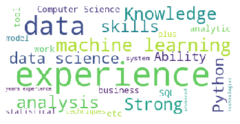

# Skills-for-Data-Science-position

Visualized the most required skills for a Data Scientist position using word cloud to identify the high frequency words.

Data Gathering - Gathered the Data manually from LinkedIn, Glassdoor and Indeed with filters such as Entry level position, full-time and Data Scientist.

## Getting Started

#### Read the course descriptions

```python
with open("Data Science Skills.txt", 'r') as fh:
 filedata = fh.read()
```

#### Check contents

```python
print("File data sample : ", filedata[:200])
```

#### Output

```
File data sample :  Booz Allen Hamilton

Experience with machine learning, data mining, statistics, data visualization, or graph algorithms in academic or internship environment
Knowledge of R, Python, SAS, or SPSS for d...
```

#### Create stopword list:

```python
from wordcloud import WordCloud, STOPWORDS
stopwords = set(STOPWORDS)
```

#### Generate wordcloud data

```python
wordcloud = WordCloud(stopwords=stopwords, max_words=25, \
                      background_color="white").generate(filedata)
```

#### Importing matplotlib for visualizations

```python
import matplotlib.pyplot as mpLib
mpLib.imshow(wordcloud)
mpLib.axis("off")
mpLib.show()
```



#### Add more words to ignore

```python
stopwords.update(["tools","system", "skills", "work", "analytic", "ability", "model", "plus","technologies", "business", "etc", "advanced", "strong","knowledge"])
```

#### Redo stop words. Limit number of words

```python
wordcloud = WordCloud(stopwords=stopwords, max_words=10, \
                      background_color="white").generate(filedata)

mpLib.imshow(wordcloud)
mpLib.axis("off")
mpLib.show()
```


